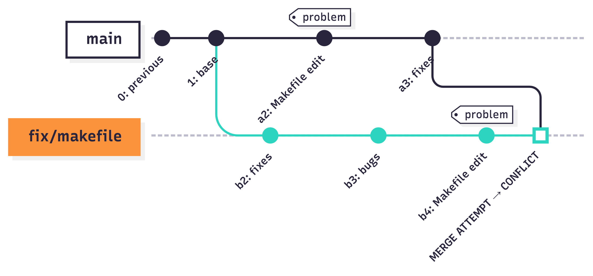
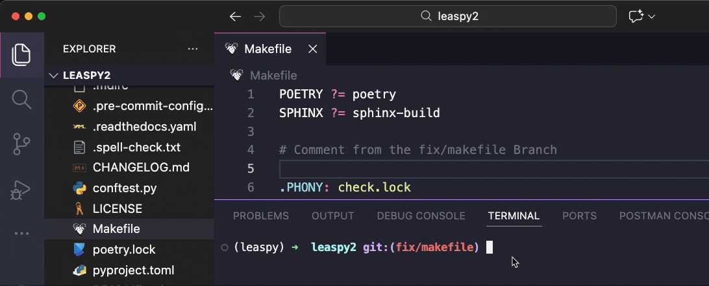
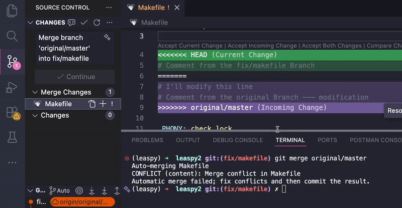
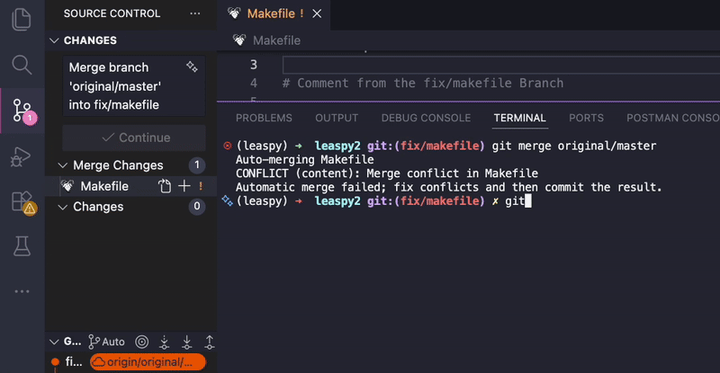

# Contribution Guide

This guide explains how to contribute to Leaspy, including setting up your environment, creating pull requests, and handling common scenarios like upstream changes.

## Key Concepts

Before diving in, let's define some Git terminology used throughout this guide:

| Term | Definition |
|------|------------|
| **Fork** | Your personal copy of the Leaspy repository on GitHub. You have full control over it. |
| **upstream** | The official Leaspy repository (`aramis-lab/leaspy`). You can read from it but not write directly. |
| **origin** | Your fork on GitHub. This is where you push your changes. |
| **fetch** | Downloads new commits from a remote (like `upstream`) without modifying your local files. Think of it as "check for updates". |
| **merge** | Combines changes from one branch into another, creating a merge commit that preserves both histories. |
| **checkout** | Switches your working directory to a different branch, or creates a new branch. |

## Repository Structure

Leaspy uses a **fork-based workflow** with the following remotes:

| Remote     | Repository                          | Purpose                        |
|------------|-------------------------------------|--------------------------------|
| `upstream` | `https://github.com/aramis-lab/leaspy` | Official repository (read-only for contributors) |
| `origin`   | Your fork on GitHub (you have to [set up](#initial-setup-first-time-contributors) first) | Your personal copy (read-write) |

### Branch Naming Convention

When we create new branches in our fork, we follow naming conventions. The name of your branch depends on what you're going to do.

| Branch Type | Pattern | Example | Description |
|-------------|---------|---------|-------------|
| Version branches | `v{major}.{minor}` | `v2.1`, `v3.0` | Active development for a minor version |
| Feature branches | `feature/{name}` | `feature/plots` | New functionality |
| Fix branches | `fix/{name}` | `fix/vulnerabilities` | Bug fixes |
| Release branches | `release/v{X.Y.Z}` | `release/v2.0.2` | Preparing a specific release |

> **Example:** If we want to fix the CSV generation methods, our branch will be called `fix/csv_generation`.

## Initial Setup (First-Time Contributors)

### 1. Fork the Repository

1. Go to [https://github.com/aramis-lab/leaspy](https://github.com/aramis-lab/leaspy)
2. Click **Fork** (top-right corner)
3. Select your account as the destination

You should now have a new repository in your account that is a copy of Leaspy.

It is safer to work there because any changes you make will not affect the official repository. Even in the worst-case scenario (e.g., you overwrite, delete, or force-push your fork), it will not affect the upstream `aramis-lab/leaspy` repository.

### 2. Clone Your Fork

```bash
git clone https://github.com/YOUR_USERNAME/leaspy.git
cd leaspy
```

### 3. Add Upstream Remote

```bash
git remote add upstream https://github.com/aramis-lab/leaspy.git
```

### 4. Verify Remotes

```bash
git remote -v
```

Expected output:
```
origin    https://github.com/YOUR_USERNAME/leaspy.git (fetch)
origin    https://github.com/YOUR_USERNAME/leaspy.git (push)
upstream  https://github.com/aramis-lab/leaspy.git (fetch)
upstream  https://github.com/aramis-lab/leaspy.git (push)
```

### 5. Set Up Development Environment

```bash
conda create -n leaspy python=3.11
conda activate leaspy
poetry install
```

## Creating a Pull Request

### Step 1: Identify the Target Branch

Before creating a branch, determine which version branch your contribution targets. This decision affects when your changes will be released to users:

| Contribution Type | Target Branch | Why? |
|-------------------|---------------|------|
| **Critical bug fixes** | `master` | Security patches or breaking bugs need immediate release. Users shouldn't wait. |
| **Regular bug fixes** | Current version branch (e.g., `v2.1`) | Will be included in the next patch release (e.g., `v2.1.1`). |
| **New features** | Next minor version branch (e.g., `v2.2`) | New functionality should wait for a planned minor release to ensure proper testing and documentation. |
| **Documentation** | Same branch as the code it documents | Keeps docs synchronized with the corresponding code version. |

> **Example:** You're fixing a typo in a docstring. The current stable version is `v2.1`. Target `v2.1` so it goes out with the next patch. But if you're adding a new algorithm, target `v2.2` (or whatever the next minor version is) so it gets proper review time.

### Step 2: Sync with Upstream

Always start from a fresh, up-to-date version of the target branch. This ensures you're working with the latest code and minimizes future conflicts.

```bash
# Download the latest commits from the official repository (without modifying your files yet)
git fetch upstream

# Create a new branch based on the upstream version branch
# This ensures your starting point is current, not your potentially outdated local copy
git checkout -b my-feature upstream/v2.1
```

The `checkout -b` command does two things: creates a new branch called `my-feature` and switches to it. The `upstream/v2.1` part tells Git to base this new branch on the upstream's `v2.1` branch (replace with your target version).

### Step 3: Make Your Changes

When committing your changes, remember that `git add .` stages **everything** you changed in the repository.
 Sometimes you may edit a file by mistake (or simply forget about a local change). That is why you should always check what you staged with `git status`.

If you staged something by accident, you can unstage it (for example with `git restore --staged <file>` to restore files to its original state, or `git reset` that will give up your `git add`), then add only what you really intend to include. Often it is safer to add files explicitly with `git add file1 file2`.

```bash
# Make changes, then stage and commit
git add .
# or
git add file1 file2 file3

git status
git commit -m "feat: add new plotting functionality"
```

Try to describe what you did and why. Commit messages like `git commit -m "changes"` are not helpful.

You can also write a multi-line commit message in your editor. If you ask an assistant (e.g., Copilot) to propose a message, review it carefully and adjust it so it matches what actually changed.

(Optional) Follow commit message conventions:
- `feat:` for new features
- `fix:` for bug fixes
- `docs:` for documentation
- `refactor:` for code restructuring
- `test:` for test additions/changes

### Step 4: Push to Your Fork

For the **first push** of a new branch, you need to set up tracking:

```bash
git push -u origin my-feature
```

The `-u` flag links your local branch to the remote branch on your fork. After this initial push, subsequent pushes only require:

```bash
git push
```

### Step 5: Create the Pull Request

1. Go to your fork on GitHub
2. Click **Compare & pull request** (appears after pushing)
3. **CRITICAL**: Verify the base repository and branch:
   - Base repository: `aramis-lab/leaspy`
   - Base branch: The target version (e.g., `v2.1`)
   - Head repository: Your fork
   - Head branch: Your feature branch

4. Fill in the PR template:
   - Clear title describing the change
   - Description of what and why
   - Reference any related issues if needed (`Fixes #123`)

5. Request reviewers
6. Submit the PR

## Handling Upstream Changes

When the official repository changes while you're working on your branch, you may need to incorporate those changes. In this project, we prefer **merge** (not rebase) because it preserves history and avoids force-push during reviews.

When the official repository changes and you have an active branch, you can face one or more of these problems:

- [New release while you're working on your branch](#scenario-new-release-while-youre-working)
- [New release and your PR is targeting the old branch](#scenario-your-pr-target-branch-changed)
- [New major release / major upstream restructuring](#scenario-major-upstream-restructuring)

### Scenario: New Release While You're Working

You're working on a feature branch, and upstream moves forward (new commits land, or a new release is cut). This can cause conflicts if the same files were modified.

**Solution: Merge the upstream target branch into your branch**

```bash
# 1. First, create a backup branch (safety net)
git branch backup-my-feature

# 2. Download the latest upstream commits
git fetch upstream

# 3. Merge the upstream branch you are targeting into your branch
# Example: if your PR targets v2.1, merge upstream/v2.1
git merge upstream/<target-branch>
```

If conflicts occur, resolve them (see [Resolving Conflicts](#resolving-conflicts)), then:

```bash
git add .
git commit -m "Merge upstream/<target-branch> into my-feature"
```

After merging, push to update your PR:

```bash
git push
```

> **Important:** Your branch does not "point to" upstream. After the merge, your branch contains a merge commit that brings in upstream changes *up to that moment*. If upstream continues to move, you may need to fetch/merge again later.

> **Why merge instead of rebase?** Merge preserves your commit history exactly as it happened and creates a clear "merge point" in the history. If something goes wrong, you can easily identify when the merge happened and revert if needed. Rebase rewrites history, which can cause confusion and requires force-pushing—risky if you're not experienced with Git.

### Scenario: Your PR Target Branch Changed

You created a PR targeting one version branch (e.g., `v2.0`), but the team decided it should go into a different version (e.g., `v2.1`) instead.

**Solution: Change the PR base branch on GitHub + merge locally**

1. **On GitHub**: Edit the PR and change the base branch to the new target

2. **Locally**: Merge the new target into your branch

```bash
git fetch upstream
git merge upstream/v2.1  # Replace v2.1 with your new target branch
git push
```

This brings your branch up to date with the new target, and your PR will update automatically.

### Scenario: Major Upstream Restructuring

If upstream undergoes significant changes (e.g., a major version is released, branch structure changes):

**Solution: Create a backup, then merge**

```bash
# 1. Create a safety backup (you can return to this if anything goes wrong)
git branch backup-my-feature-before-sync

# 2. Fetch upstream
git fetch upstream

# 3. Merge the target branch
git merge upstream/v2.1  # Replace with your target version

# 4. Resolve any conflicts, then push
git push
```

The backup branch lets you compare what changed or restore your work if the merge doesn't go as expected.

## Resolving Conflicts

### In VS Code

To show how to resolve merge conflicts in practice, we will use a simplified example. We have two branches: `original/master` and `fix/makefile`.

The branch `fix/makefile` was created from `original/master`. Then both branches added commits that modify the same file (`Makefile`). When we try to merge `original/master` into `fix/makefile`, we will get merge conflicts.

In this example, we want to bring all changes from `original/master` into `fix/makefile`.

<div align="center"></div>

1. When a conflict occurs, VS Code shows affected files in the Source Control panel
	&nbsp;
   <div align="center">  </div>
	&nbsp;
2. Open a conflicted file - you'll see conflict markers:
	&nbsp;
   ```
   <<<<<<< HEAD
   your changes
   =======
   upstream changes
   >>>>>>> upstream/v2.1
   ```
3. VS Code provides buttons above each conflict:
   - **Accept Current Change**: Keep your version
   - **Accept Incoming Change**: Keep upstream's version
   - **Accept Both Changes**: Include both
   - **Compare Changes**: See side-by-side diff
	&nbsp;
   <div align="center"> </div>
<br>

4. After resolving all conflicts in a file, stage it:
   ```bash
   git add <filename>
   ```

5. Continue the merge:
   ```bash
   git commit -m "Merge upstream changes"
   ```
	&nbsp;
   <div align="center"></div>
<br>

This resolves the conflicts and brings the changes from the main branch into your branch. In real projects, conflicts are often more complex than this, but the process is the same: go file by file and resolve conflicts one by one.

> **TIP:** One of the worst scenarios is having many conflicts after working for a long time, because you may not remember what you changed (or why). To avoid this, sync with upstream regularly.

### Common Conflict Scenarios

| Conflict Type | Typical Resolution |
|---------------|-------------------|
| Both modified same line | Manually combine logic |
| File deleted upstream, modified locally | Decide if changes are still needed |
| Both added same file | Merge contents or choose one |

> **Note:** For `poetry.lock` conflicts, accept either version and then run `poetry lock` to regenerate it properly. See [Dependency Management](Dependency_management.md) for more details.

## Code Review Process

### As a Contributor

1. Respond to all review comments
2. Make requested changes in new commits (don't force-push during review unless asked)
3. Re-request review after addressing feedback
4. Once approved, a maintainer will merge

### As a Reviewer

Check the following before approving:

- [ ] Code follows project style. Run `ruff check .` locally to verify. Ruff is a fast Python linter that checks for code style issues and potential bugs (see [Ruff documentation](https://docs.astral.sh/ruff/)).
- [ ] Tests pass (`pytest`)
- [ ] Documentation updated if needed
- [ ] No unrelated changes included
- [ ] Commit messages are clear
- [ ] PR targets the correct branch

## Troubleshooting

### "Cannot merge: You have unstaged changes"

Git won't let you merge if you have uncommitted changes. You have two options:

**Option 1: Commit your changes first**
```bash
git add .
git commit -m "WIP: my current work"
git merge upstream/<target-branch>
```

**Option 2: Stash your changes temporarily**

Stashing saves your uncommitted changes to a temporary storage, letting you work with a clean state:
```bash
# Save current changes to stash
git stash

# Now you can merge
git merge upstream/<target-branch>

# Restore your stashed changes
git stash pop
```

### PR Shows Wrong Commits

If your PR shows commits that aren't yours, your branch has diverged from the target. Merge the target into your branch:
```bash
git fetch upstream
git merge upstream/<target-branch>  # Replace with your target branch (e.g., upstream/v2.1)
git push
```
