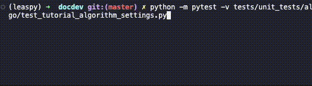

# Writing a Unit Test

A **unit test** checks one small behavior: one function, one method, or one class in isolation. In this tutorial, you will create a real test, run it, make it fail on purpose, and learn how to choose the Leaspy helpers you need.

You do not need to remember the whole [How Leaspy's Tests Work](testing.md) guide. We will briefly reintroduce each piece when we use it. If your test needs to run a complete workflow such as fitting or personalizing a model, go instead to [Writing a Functional Test](writing_functional_tests.md).

The example below exercises existing behavior so that everyone can obtain the same result. It is a practice test: use the same structure for your change, but do not submit the tutorial file as a duplicate of the existing test suite.

## Step 0: Is this a unit test?

Before creating a file, describe what you want to check in one sentence.

```{mermaid}
%%{init: {"flowchart": {"rankSpacing": 30, "nodeSpacing": 30}} }%%
flowchart TD
    classDef q      fill:#EEF2FF,stroke:#4F46E5,stroke-width:2px,color:#1F2A5A,rx:8,ry:8;
    classDef unit   fill:#E6FFFB,stroke:#0F766E,stroke-width:2px,color:#134E4A,rx:8,ry:8;
    classDef func   fill:#FFF7ED,stroke:#C2410C,stroke-width:2px,color:#7C2D12,rx:8,ry:8;

    Q{"Can the behavior be checked<br/>without running a complete<br/>Leaspy workflow?"}:::q
    U("Yes: write a unit test<br/><i>one gear of the machine</i>"):::unit
    F("No: write a functional test<br/><i>fit, personalize, estimate, simulate...</i>"):::func

    Q -->|yes| U
    Q -->|no| F
```

## Step 1: Put the test in the right place

Unit-test folders mirror the code under `src/leaspy/`. `AlgorithmSettings` lives in `src/leaspy/algo/`, so create:

```text
tests/unit_tests/algo/test_tutorial_algorithm_settings.py
```

Pytest discovers tests by their names:

| Element | Rule | Our example |
|---------|------|-------------|
| **File** | Name it `test_*.py` | `test_tutorial_algorithm_settings.py` |
| **Folder** | Keep an `__init__.py` in every test subfolder | `tests/unit_tests/algo/__init__.py` already exists |
| **Class** | Inherit from `LeaspyTestCase`; conventionally include `Test` in its name | `AlgorithmSettingsTutorialTest` |
| **Method** | Start its name with `test_` and describe the behavior | `test_constant_prediction_uses_last_value_by_default` |

Start with this discovery checkpoint:

```python
from tests import LeaspyTestCase


class AlgorithmSettingsTutorialTest(LeaspyTestCase):
    def test_constant_prediction_uses_last_value_by_default(self):
        pass
```

Run it from the repository root:

```bash
python -m pytest -v tests/unit_tests/algo/test_tutorial_algorithm_settings.py
```

You should see `1 passed`. At this moment, that only proves pytest found the file, class, and method. A test containing `pass` checks nothing, so replace it immediately in the next step.

<!-- TODO(GIF): create the skeleton in VS Code, run the command, and show one discovered green test -->
<div align="center"></div>

## Step 2: Arrange, Act, Assert

A clear test reads in three phases:

```{mermaid}
flowchart LR
    classDef step fill:#EEF2FF,stroke:#4F46E5,stroke-width:2px,color:#1F2A5A,rx:8,ry:8;
    classDef check fill:#E6FFFB,stroke:#0F766E,stroke-width:2px,color:#134E4A,rx:8,ry:8;

    A("1 - Arrange<br/><i>define what you need</i>"):::step
    B("2 - Act<br/><i>run the behavior</i>"):::step
    C("3 - Assert<br/><i>check the result</i>"):::check
    A --> B --> C
```

This is known as **Arrange–Act–Assert**. Replace the practice skeleton with the meaningful test:

```python
from leaspy.algo import AlgorithmSettings
from tests import LeaspyTestCase


class AlgorithmSettingsTutorialTest(LeaspyTestCase):
    def test_constant_prediction_uses_last_value_by_default(self):
        # Arrange: state the expected behavior
        expected_prediction_type = "last"

        # Act: create the object we want to test
        settings = AlgorithmSettings("constant_prediction")

        # Assert: compare the actual value with the expected one
        self.assertEqual(
            settings.parameters["prediction_type"], expected_prediction_type
        )
```

Read the test like a sentence: *when I create the constant-prediction settings without overriding anything, the resulting prediction type is `last`.*

The assertion comes from Python's [`unittest.TestCase`](https://docs.python.org/3/library/unittest.html#unittest.TestCase), through Leaspy's own `LeaspyTestCase`. If both values are equal, execution continues and the test passes. If not, the assertion raises an error and pytest reports the test as failed.

## Step 3: Run the smallest useful target

While writing a test, run only that method. Pytest identifies it with `file::class::method`:

```bash
python -m pytest -v \
  tests/unit_tests/algo/test_tutorial_algorithm_settings.py::AlgorithmSettingsTutorialTest::test_constant_prediction_uses_last_value_by_default
```

The important part of the output is:

```{raw} html
<div class="highlight-text notranslate"><div class="highlight"><pre>collected 1 item

tests/unit_tests/algo/test_tutorial_algorithm_settings.py::AlgorithmSettingsTutorialTest::test_constant_prediction_uses_last_value_by_default PASSED [100%]

<span class="sd-text-success">========================= 1 passed in 2.07s =========================</span></pre></div></div>
```

This fast feedback loop is useful while you work. Before opening a pull request, you will run a wider set of tests because your code may affect more than this method.

## Step 4: Break it on purpose

A green test is reassuring only if it becomes red when the behavior is wrong. Change the expectation temporarily:

```python
expected_prediction_type = "mean"  # deliberately wrong
```

Run the same command. The failure ends with:

```{raw} html
<div class="highlight-text notranslate"><div class="highlight"><pre>
========================= short test summary info =========================
FAILED tests/unit_tests/algo/test_tutorial_algorithm_settings.py::AlgorithmSettingsTutorialTest::test_constant_prediction_uses_last_value_by_default
- AssertionError: 'last' != 'mean'
<span class="sd-text-danger">========================= 1 failed in 2.13s =========================</span></pre></div></div>
```

The **actual value** produced by Leaspy is `last`; the **expected value** written in the test is `mean`. This controlled failure confirms that your assertion watches the behavior you intended to protect.

Restore `"last"` and run the test once more before continuing.

Useful flags during this fix-and-rerun loop are:

| Flag | Effect | Example |
|------|--------|---------|
| `-v` | Show the full name of every test | `python -m pytest -v ...` |
| `-x` | Stop after the first failure | `python -m pytest -x ...` |
| `--lf` | Rerun tests that failed last time | `python -m pytest --lf` |
| `-k WORDS` | Select tests whose names match an expression | `python -m pytest -k constant_prediction` |
| `-s` | Show output from `print(...)` | `python -m pytest -s ...` |


## Common variations

The first example uses `assertEqual`, but the shape of a test stays the same when the behavior changes: prepare, act, then choose an assertion that expresses the expected result.

### Skipping a test when a requirement is unavailable

A **skipped** test is neither green nor red: pytest found it, but deliberately did not execute it. Leaspy uses `unittest.skipIf` for tests that require optional hardware or an unavailable feature. For example, the GPU tests use this pattern:

```python
import unittest

import torch
from tests import LeaspyTestCase


@unittest.skipIf(
    not torch.cuda.is_available(),
    "GPU calibration tests need an available CUDA environment",
)
class GPUModelFit(LeaspyTestCase):
    def test_all_model_gpu_run(self):
        # GPU-specific Arrange–Act–Assert code
        ...
```

Run pytest with `-rs` to include the reason for every skipped test:

```bash
python -m pytest -v -rs \
  tests/unit_tests/models/test_gpu_model_fit.py::GPUModelFit::test_all_model_gpu_run
```

```{raw} html
<div class="highlight-text notranslate"><div class="highlight"><pre>tests/unit_tests/models/test_gpu_model_fit.py::GPUModelFit::test_all_model_gpu_run SKIPPED [100%]

SKIPPED [1] tests/unit_tests/models/test_gpu_model_fit.py:15: GPU calibration tests need an available CUDA environment
<span class="sd-text-warning">========================= 1 skipped in 1.67s =========================</span></pre></div></div>
```

Prefer a conditional skip with a clear reason. An unconditional `@unittest.skip("reason")` is appropriate only for a known, explicitly tracked limitation; it should not be used to hide an unexplained failure.

### Expecting an error

If invalid input should be rejected, the error itself is the expected result:

```python
def test_unknown_algorithm_is_rejected(self):
    with self.assertRaisesRegex(
        ValueError, "'unknown-algo' is not a valid AlgorithmName"
    ):
        AlgorithmSettings("unknown-algo")
```

`assertRaisesRegex` checks both the exception type and a meaningful part of its message. The test fails if no error is raised, if the type is wrong, or if the message does not match.

### Comparing numerical results

Floating-point calculations can differ by tiny rounding errors. Leaspy provides tolerance-aware assertions:

```python
self.assertAllClose(actual_tensor, expected_tensor, atol=1e-6, rtol=1e-5)
self.assertDictAlmostEqual(actual_parameters, expected_parameters, atol=1e-6)
```

Use `assertAllClose` for one number, array, or tensor. Use `assertDictAlmostEqual` for a dictionary, including nested dictionaries; it compares every numerical value and reports all differences together.

### Using existing test data and a safe temporary folder

`LeaspyTestCase` provides a few helpers for test files:

- `get_hardcoded_model("logistic_scalar_noise")` loads `tests/_data/model_parameters/hardcoded/logistic_scalar_noise.json`. Choose an existing file from that folder and pass its name **without** `.json`.
- `get_test_tmp_path("model.json")` returns `tests/_data/_tmp/<TestClassName>/model.json`. It does not create the file; the folder is created before the class runs and removed afterward.

`ModelSaveLoadTest` below is an ordinary test class, not a saving utility. If a suitable test class already exists in your file, add the method there instead of creating this exact class.

```python
from leaspy.models import BaseModel
from tests import LeaspyTestCase


class ModelSaveLoadTest(LeaspyTestCase):
    def test_saved_model_can_be_loaded(self):
        # Arrange: load a stable model fixture and choose a safe output path
        model = self.get_hardcoded_model("logistic_scalar_noise")
        output_path = self.get_test_tmp_path("model.json")

        # Act: call the real Leaspy save and load methods
        model.save(output_path)
        reloaded_model = BaseModel.load(output_path)

        # Assert: the file exists and its parameters were preserved
        self.assertHasTmpFile("model.json")
        self.assertDictAlmostEqual(
            reloaded_model.parameters,
            model.parameters,
        )
```

The `self.*` helpers come from `LeaspyTestCase`; `model.save(...)` and `BaseModel.load(...)` are the real Leaspy operations being tested. The toolbox below lists the other common helpers.

## The Leaspy unit-test toolbox

Every test inherits these helpers from `LeaspyTestCase`:

| Helper | What it provides | Typical unit-test use |
|--------|------------------|-----------------------|
| `get_test_data_path(...)` | A path under `tests/_data/` | Load a small, versioned fixture |
| `get_hardcoded_model(name)` | A stable model defined by a hand-written JSON file | Test model behavior without fitting |
| `get_hardcoded_individual_params(file)` | Stable individual parameters | Test estimation or serialization behavior |
| `get_algo_settings(name=..., **params)` | An `AlgorithmSettings` object | Prepare algorithm configuration |
| `get_test_tmp_path(...)` | A safe path in the class's temporary folder | Any file created by the test |
| `allow_abstract_class_init(SomeABC)` | Temporary permission to instantiate an abstract class | Unit-test concrete behavior defined on a base class |

The custom assertions most often used are:

| Assertion | Checks that... |
|-----------|----------------|
| `assertAllClose(actual, expected)` | Numerical values are equal within tolerances |
| `assertDictAlmostEqual(actual, expected)` | Nested dictionaries match, with numerical tolerances |
| `assertShapeEqual(value, (2, 4))` | An array or tensor has the expected shape |
| `assertLenEqual(value, 3)` / `assertEmpty(value)` | A container has the expected length / is empty |
| `assertOrderedDictEqual(a, b)` | Two dictionaries have equal values in the same key order |
| `assertHasTmpFile("file.json")` | The test created a file in its private temporary folder |

If you override `setUpClass`, call `super().setUpClass()` first. If you override `tearDownClass`, call `super().tearDownClass()` last. Those base methods create and remove the temporary folder. During debugging, `TMP_REMOVE_AT_END = False` keeps the files for inspection; return it to `True` before committing.

## When one test becomes many

Start with the clearest self-contained test. Only extract code after real repetition appears:

```text
one test
└── keep the code inline

several tests in one class
└── extract a local helper method

the same helper needed by several test files
└── create a mixin

a helper useful to nearly every Leaspy test
└── consider adding it to LeaspyTestCase
```

A mixin is therefore not required for your first test. When you do need one, remember its two safety rules:

1. A mixin helper must **not** start with `test_`, or pytest will collect it as a test in every class that inherits it.
2. Other files may import the mixin, but must **never import its concrete test class**, or pytest will collect those tests again.

The inheritance diagram and a complete explanation live in [How Leaspy's Tests Work](testing.md), under “The mixin system.”

## Before you open your PR

Use increasingly wide checks: fast and specific while developing, broad before handing the change to CI.

```bash
# 1. The test you are writing
python -m pytest -v path/to/test_file.py::TestClass::test_method

# 2. The relevant unit-test folder
python -m pytest -v tests/unit_tests/algo

# 3. The same full-suite command used by GitHub Actions
make test
```

The current GitHub Actions workflow runs `make test` on Ubuntu and macOS with Python 3.9, 3.10, 3.11, 3.12, and 3.13. Despite the workflow step being named “Run unit tests,” `make test` executes the entire `tests/` directory, so functional tests run too.

Final unit-test checklist:

- [ ] The test describes one behavior in its name.
- [ ] Its folder mirrors the code it tests, and the folder contains `__init__.py`.
- [ ] It inherits from `LeaspyTestCase`.
- [ ] It fails when the behavior is deliberately made wrong.
- [ ] It uses stable fixtures and writes only through `get_test_tmp_path`.
- [ ] The targeted test, relevant folder, and full suite pass.
- [ ] The tutorial practice file was removed, or its example was adapted to test genuinely new behavior.

````{dropdown} Copyable unit-test template
:color: primary
:icon: copy

```python
from tests import LeaspyTestCase


class MyFeatureTest(LeaspyTestCase):
    def test_describe_the_expected_behavior(self):
        # Arrange
        expected = ...

        # Act
        actual = ...

        # Assert
        self.assertEqual(actual, expected)
```

Replace the placeholders, then run the method directly with `python -m pytest -v file::class::method`.
````

You now have a complete unit-test workflow. If your change must verify a complete fit, personalization, estimation, or simulation, continue with [Writing a Functional Test](writing_functional_tests.md).
