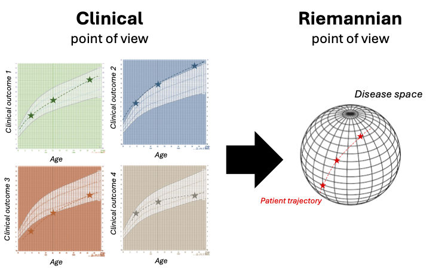
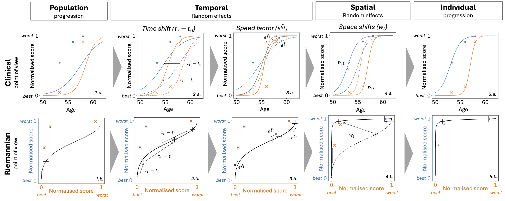

# Mathematical Background

## Mixed effect models

*Talk about mixed-effect models and their ability to handle missing values*

## Riemanian framework
ALS
### Disease progression represented as trajectory
As presented in the figure, the model draws a parallel line between a clinical and a Riemannian point of view of the disease progression. The idea is to see the variability of the disease progression as a Riemannian manifold where the longitudinal observations $y_{i,j,k}$  are aligned in an individual trajectory $\gamma_i$ that traverses the manifold. 


__From clinical to Riemannian point of view (extracted from {cite}`ortholand_joint_2024`)__


__From clinical to Riemannian point of view__
_On the left, the progression of four clinical outcomes for one patient is represented depending on the age of the patient. The graph displays the individual progression of one patient on a grid detailing the typical progression of the disease, as it is done in health diaries for BMI curves. This represents how a clinician is used to see the progression of the patient. On the right, progression of the same patient is represented but this time in a disease space (manifold) built thanks to the information extracted from the four clinical outcomes. This represents the Riemannian point of view of the progression of the patient._

### Trajectory shape defined by Riemmanian metric
The shape of the disease progression (linear, logistic ...) is defined by the choice of the Riemannian metric ($G(p)$) applied to the manifold. For instance, the manifold $\mathbb{R}^n$ equipped with Euclidean metric gives straight lines trajectories and thus straight lines disease progression.  For a K-dimensional dataset, we used the product manifold of a 1-dimensional metric. The disease trajectory is a geodesic if and only if it satisfies a differential equation with the metric, further described in {cite}`koval_learning_2020` (p.169). This enable to get from the metric formulation the shape of the curve in time.

__Application context:__ Here, we want to model clinical data such as clinical scores. Such data have a potential floor or ceiling effects {cite}`gordon_progression_2010`, thus a logistic curve is often used. The Riemmanian metric $G(p)$ and the manifold $M$ that enable to define a logistic progression through time are: $G(p) = \frac{1}{p^2(1-p)^2}$ an $M = (0, 1)$.

### Individual variability define as initial conditions

__Population trajectory & Fixed effects:__ To separate the average disease progression from the individual progression, a mixed-effects model structure is added to the trajectories.  Any trajectory $\gamma$ (geodesic) can be defined by the two parameters of its initial condition at a time $t_0$: the initial position $\gamma(t_0) = p$ and the initial speed $\dot{\gamma}(t_0) = v_0$. The average trajectory  $\gamma_0$ is thus parametrized by its initial conditions ($t_0, v_0, p$) with a shape imposed by the metric. From there, the individual trajectory $\gamma_i(t)$ could be defined playing on the three initial conditions.

__Individual trajectory & Temporal random effects:__  If a patient starts to have symptoms of the disease $\tau_i - t_0$ earlier (later) than the average population, than it impacts the initial condition with ($\tau_i, v_0, p$). A second option, is that the patient will have a faster (slower) disease progression with a factor $e^{\xi_i}$, this time initial conditions are impacted so that ($t_0, v_0e^{\xi_i}, p$). Note that the two first aspect encompass temporal variability. From a mathematical point of view there impact could be seen as a transformation of the age of the patient into a latent disease age, as there effect on the trajectory is restricted to the reparametrisation of the time by the formula $\psi(t) = v_0 e^{\xi_i} (t -\tau) + t_0$. 

__Individual trajectory & Spatial random effects:__ Finally, patients my vary in terms of disease presentation, i.e. from a clinical point of view which means the order of outcome progression might not be the same. From a geometric point of view, this means that the geometric trajectory is not overlapping through the same points. This variability is enabled by manipulating the initial position $p$. It is done thanks to the vectors $w_k$ named space-shifts in the tangent space of the trajectory that modified the trajectory in the sense of the Exp-parallelisation to assure the identifiability.



__Temporal and spatial random effects: from population to individual progression (extracted from {cite}`ortholand_joint_2024`)__
_This figure presents from two points of view (clinical and Riemannian) how the three types of random effects (two temporal and one spatial) enable to modify the population average progression to calibrate the patient observations. Clinical: Two normalised clinical scores (blue and orange) (0: the healthiest value, +1: the maximum pathological change) depending on the age of the patients The scatter represents the real observed values for one patient at different visits. Riemannian: The same two normalised scores are represented but this time depending on each other. The scatter represents the same real observed values as in the clinical version. The black cross on the curve corresponds to what is modelled at the visit ages of the patient._
- Population progression (1.a., 1.b.): Population average trajectory compared to the observed values of the patient. 
- Time Shift (2.a., 2.b.): The progression starts earlier due to the individual estimated reference time, Clinical graph: the curves are shifted on the left, Riemannian graph: black crosses are shifted on the right following the trajectory (for the same age the patient is more advanced).
- Speed factor (3.a., 3.b.): The progression speed increases, Clinical graph: the curves become steeper, Riemannian graph: black crosses get further from each other on the trajectory (for the same time of follow-up a wider portion of the trajectory is observed).
- Space Shift (4.a., 4.b.): the blue curves progress before the orange curve, Clinical graph: the curves are shifted in opposite directions, Riemannian graph: most of the blue (resp. orange) score value is observed for an orange (resp. blue) value of 0 (resp. 1)
- Individual progression (5.a., 5.b.): The modelled curves fit the observations, Riemannian graph: the black crosses are close to the observed values.

## References

```{bibliography}
:filter: docname in docnames
```