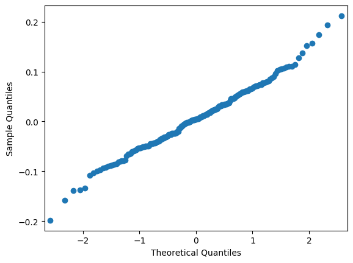

# Models Evaluation

## Convergence diagnosis

## Likelihood based metrics

## Fit metrics

Leaspy stores three negative log likelihood (nll) values in the `fit_metrics` of the model’s json file:
- `nll_attach`: $-\log p(y \mid z, \theta, \Pi)$, where $y$ are the observations, $z$ the latent parameters, $\theta$ the model parameters, and $\Pi$ the hyperparameters. It corresponds to the nll attached to the data.
- `nll_regul_ind_sum`: $-\log p(z_{\text{re}} \mid z_{\text{fe}}, \theta, \Pi)$, where $z_{\text{re}}$ denotes the latent random effects and $z_{\text{fe}}$ the latent fixed effects. It corresponds to the nll from the random effects.
- `nll_tot`: $-\log p(y, z, \theta \mid \Pi)$. It corresponds to the total nll: nll_attach, nll_regul_ind_sum and the nll linked to the individual parameters (`v0`,`xi`,`tau`), that is not reported directly in the json file.

The last conditional nll can be used for computing fit metrics.

### Bayesian Approach

#### WAIC
WAIC (Watanabe – Akaike information criterion), defined by Watanabe in 2010 {cite}`watanabe2010asymptotic`, is a metric permitting comparing different Bayesian models. Lower values of WAIC correspond to better performance of the model.  
For example, the version by Vehtari, Gelman, and Gabry (2017) {cite}`vehtari2017practical` can be used in the Leaspy framework, with β = 1 and multiplied by -2 to be on the deviance scale. To compute it, the probability of observation given the parameters should be computed for each iteration. Two versions can be computed using the conditional or the marginal likelihood.  
The marginal likelihood is more robust {cite}`millar2018bayesian`, but it is harder to compute as the integral must be estimated. It is usually estimated using Laplace’s approximation, which corresponds to a Taylor expansion {cite}`daxberger2021laplace`.  

$$
\text{WAIC} = -2 \cdot \sum_{i=1}^{n} \log(p(y_i | \hat{\theta}_i))
$$

Where $p(y_i | \hat{\theta}_i)$ is the probability of the observation given the estimated parameters $\hat{\theta}_i$, and $n$ is the number of data points.

Package: `leaspy`

### Frequentist Approach

#### AIC
AIC (Akaike Information Criterion) is a robust metric for model selection. It integrates the goodness-of-fit and the complexity of the model (number of features and number of patients). It has a penalty term for the number of parameters in the model, thus penalizing more complex models with unnecessary features. Lower AIC values indicate a better model {cite}`akaike1974new`.

$$
\text{AIC} = 2 \cdot (\text{nb}_{\text{features}}) - 2 \cdot \log(\text{likelihood})
$$

Package: `leaspy` 

```python
# Get the negative log-likelihood
neg_LL = model.state['nll_attach']

# Compute the number of free parameters
n_individuals = data.n_individuals
population_parameters_total = (
        3 + 2 * model.dimension + (model.dimension - 1) * (model.source_dimension)
    )
individual_parameters_per_subject = 2 + model.source_dimension
free_parameters_total = population_parameters_total + n_individuals * individual_parameters_per_subject

penalty = 2 * free_parameters_total

aic = penalty + 2 * neg_LL
print(f"AIC: {aic}")

AIC: -17236.7421875
```

#### BIC
BIC (Bayesian Information Criterion) is similar to the AIC metric, but it also integrates the number of patients. It penalizes both the number of features and the number of patients {cite}`schwarz1978estimating`.

$$
\text{BIC} = \log(\text{nb}_{\text{patients}}) \cdot \text{features} - 2 \cdot \log(\text{likelihood})
$$

Package: `leaspy`

```python
# Get the negative log-likelihood
neg_LL = model.state['nll_attach']

# Compute the number of free parameters
n_individuals = data.n_individuals
population_parameters_total = (
        3 + 2 * model.dimension + (model.dimension - 1) * (model.source_dimension)
    )
individual_parameters_per_subject = 2 + model.source_dimension
free_parameters_total = population_parameters_total + n_individuals * individual_parameters_per_subject

n_observations = data.n_visits
penalty = free_parameters_total * np.log(n_observations)

bic = penalty + 2 * neg_LL
print(f"BIC: {bic}")

BIC: -12671.0820312
```

The BIC with a correction for mixed effects models can also be computed, see {cite}`delattreNoteBICMixedeffects2014` for more details. 

```python
individual_parameters_total = individual_parameters_per_subject * n_individuals

penalty = individual_parameters_total * np.log(n_individuals) + population_parameters_total * np.log(n_observations)

bic_corrected = penalty + 2 * neg_LL
print(f"Corrected BIC: {bic_corrected}")

Corrected BIC: -14503.0869140625
```

## Prediction metrics

These metrics could be computed either on predictions or in reconstructions. Note that all this could be stratified by the different groups you have in your dataset. You might want these metrics to be independent from it.

### Repeated Measures

This section describes the main metrics used to evaluate the quality of predictions from the Leaspy non-linear mixed-effects model.

#### Mean Absolute Error (MAE)

$$
MAE = \frac{1}{n} \sum_{i=1}^{n} |y_i - \hat{y}_i|
$$

MAE is more robust to outliers and provides a straightforward sense of typical prediction error.

Package: [`sklearn.metrics`](https://scikit-learn.org/stable/modules/generated/sklearn.metrics.mean_absolute_error.html)

```python
from sklearn.metrics import mean_absolute_error

# Keep the TIME we want to predict at
alzheimer_df_to_pred = alzheimer_df.groupby('ID').tail(1)
# Predict using estimate
reconstruction = model.estimate(alzheimer_df_to_pred.index, individual_parameters)
df_pred = reconstruction.add_suffix('_model1')
# Compute the MAE
mae = mean_absolute_error(alzheimer_df_to_pred["MMSE"], df_pred["MMSE_model1"])
print(f"Mean Absolute Error: {mae}")

Mean Absolute Error: 0.050412963298149406
```

#### Mean Square Error (MSE)

$$
MSE = \frac{1}{n} \sum_{i=1}^{n} (y_i - \hat{y}_i)^2
$$

MSE penalizes larger errors more heavily than MAE, making it more sensitive to outliers {cite}`willmott2005advantages`{cite}`chai2014root`.

Package: [`sklearn.metrics`](https://scikit-learn.org/stable/modules/generated/sklearn.metrics.mean_squared_error.html)

```python
from sklearn.metrics import mean_squared_error

# Keep the TIME we want to predict at
alzheimer_df_to_pred = alzheimer_df.groupby('ID').tail(1)
# Predict using estimate
reconstruction = model.estimate(alzheimer_df_to_pred.index, individual_parameters)
df_pred = reconstruction.add_suffix('_model1')
# Compute the MSE
mse = mean_squared_error(alzheimer_df_to_pred["MMSE"], df_pred["MMSE_model1"])
print(f"Mean Squared Error: {mse}")

Mean Squared Error: 0.0041833904503857655
```

#### Residual Q-Q Plot
A graphical tool to assess whether residuals follow a normal distribution, which is an assumption in many mixed-effects models {cite}`fox2015applied`.

Package: [`statsmodels.api`](https://www.statsmodels.org/stable/generated/statsmodels.graphics.gofplots.qqplot.html)

```python
import statsmodels.api as sm
from matplotlib import pyplot as plt

# Compute the residuals
res = alzheimer_df_to_pred["MMSE"] - df_pred["MMSE_model1"]
fig = sm.qqplot(res)
plt.show()
```




#### Coefficient of Determination (R²)
R² indicates how well the model explains the variance in the observed data. Higher values (closer to 1) suggest better performance.

$$
R^2 = 1 - \frac{\sum_{i=1}^{n} (y_i - \hat{y}_i)^2}{\sum_{i=1}^{n} (y_i - \bar{y})^2}
$$

In mixed-effects models, multiple R² variants exist (e.g., marginal vs. conditional R²) to account for fixed and random effects {cite}`nakagawa2012method`.

Package: [`sklearn.metrics`](https://scikit-learn.org/stable/modules/generated/sklearn.metrics.r2_score.html)

```python
from sklearn.metrics import r2_score
r2 = r2_score(alzheimer_df_to_pred["MMSE"], df_pred["MMSE_model1"])
print(f"R² Score: {r2}")

R² Score: 0.9442675319358963
```

### Events

For the joint model, it is useful to have prediction metrics on survival as well:

#### Integrated Brier Score (IBS)
The Integrated Brier Score (IBS) is a robust metric used to evaluate the predictive accuracy of survival models. 
In survival analysis, IBS quantifies how well a model predicts the timing of events by integrating the Brier Score, a measure of prediction error for probabilistic outcomes, across all observed time points. It compares the model’s predicted survival probabilities against actual observed outcomes, penalizing discrepancies between predictions and reality. IBS accounts for censored data, ensuring reliability in real-world datasets where not all events are fully observed. IBS describes how closely predictions match reality. A low IBS indicates superior predictive performance, as it reflects smaller cumulative errors over time {cite}`graf1999assessment`.

Package: [`scikit-survival`](https://scikit-survival.readthedocs.io/en/stable/api/generated/sksurv.metrics.integrated_brier_score.html)

#### Cumulative Dynamic AUC
Cumulative AUC (or time-dependent AUC) evaluates the model’s ability to discriminate between subjects who experience an event by a specific time and those who do not, based on their predicted risk scores. It focuses on ranking accuracy, ensuring high-risk subjects receive higher predicted probabilities than low-risk ones at each time point. Cumulative AUC describes how well risks are ordered. A high cumulative AUC means a strong discriminatory ability {cite}`uno2007evaluating` {cite}`hung2010estimation` {cite}`lambert2014summary`.

Package: [`scikit-survival`](https://scikit-survival.readthedocs.io/en/stable/api/generated/sksurv.metrics.cumulative_dynamic_auc.html)

#### Avoid using C-index
The C-index or Concordance index, similarly to the cumulative AUC, is a metric assessing the discriminatory ability of a survival model. However, this metric is criticized because it is a global metric that averages performance over the entire study period, hiding time-specific weaknesses {cite}`blanche2019cindex`. It also depends on the censoring distribution. Therefore, it is more convenient to use time-dependent AUC and the Brier Score presented above.

## References

```{bibliography}
:filter: docname in docnames
```
